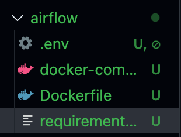
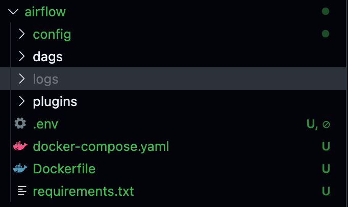

In this blog post, I’ll walk you through how I set up [**Apache Airflow**](https://airflow.apache.org) on my home server using Docker Compose. My goal was to create a personal automation environment where I can run and schedule custom workflows daily.

### My Setup

Before diving into the steps, here’s a quick overview of the machine I used:

-   **Model:** Dell OptiPlex 9020
-   **CPU:** Intel i5 (4th Gen)
-   **RAM:** 8GB
-   **Storage:** 250GB SSD
-   **OS:** Linux Mint (replaced original Windows installation)

### Getting Started

The Airflow team officially recommends using **Docker Compose** for lightweight production use-cases. It simplifies service management, container isolation, and scaling.

I followed the official documentation here:  
👉 [Running Airflow in Docker with Compose](https://airflow.apache.org/docs/apache-airflow/stable/howto/docker-compose/index.html)

#### Step 1: Download the Official Docker Compose File

First, I downloaded the official `docker-compose.yaml` file:

curl -LfO 'https://airflow.apache.org/docs/apache-airflow/3.0.2/docker-compose.yaml'

This file defines how different Airflow services (like the scheduler, webserver, and workers) should be run in containers.

#### Step 2: Create a `.env` File and Set `AIRFLOW_UID`

In the same directory as the `docker-compose.yaml`, I created a `.env` file and added this line:

AIRFLOW_UID\=1000

When running Docker containers, especially with volume mounts (e.g., for DAGs, logs, or plugins), file permissions can become an issue. `AIRFLOW_UID` specifies which user ID should be used inside the container to run Airflow processes.

By default, the Airflow Docker image runs as a non-root user (for security). Setting `AIRFLOW_UID` to match your host user's UID ensures that the container and your file system work together without permission conflicts.

*🔍 You can find your current UID by running:*`*id -u*`

If you incorrectly mention your UID, you might run into permission errors with folders like `logs/` or `dags/`.

#### Step 3: Add Custom Python Dependencies

The official image is great, but if you need to install additional Python packages (like `requests`, `pandas`, or any Airflow providers), you'll want to customize the image using a `Dockerfile`.

First, I created a `Dockerfile`:

FROM apache/airflow:3.0.2  
ADD requirements.txt .  
RUN pip install apache\-airflow\=\=3.0.2 \-r requirements.txt

This builds on top of the official image and installs any dependencies listed in `requirements.txt`.

*📚 Reference:* [*Adding Dependencies in Docker*](https://airflow.apache.org/docs/apache-airflow/stable/howto/docker-compose/index.html#special-case-adding-dependencies-via-requirements-txt-file)

Then, I modified the `docker-compose.yaml` to build from my Dockerfile instead of pulling the default image.

Replace this line (around line 52):

image: ${AIRFLOW_IMAGE_NAME:-apache/airflow:3.0.2}

With:

build: .

#### Step 4: Create `requirements.txt`

In the same folder, I created a `requirements.txt` file and added any Python libraries I wanted. For example:

requests  
pandas

You can list any PyPI packages you need for your DAGs here.

Your directory structure would look something like this now:

Directory Structure before running the containers

#### Step 5: Build the Docker Image

Finally, I ran:

docker compose build

This builds a new Docker image based on your `Dockerfile` and installs your listed dependencies.

#### Step 6: Run the containers

Run the following command to start Apache Airflow and run the containers in the background:

docker compose up -d

Now, your directory structure should look something like this:

Directory Structure after running the containers

Then visit [**http://localhost:8080**](http://localhost:8080/) in your browser and login with username `airflow` and password `airflow` .

With that, you have successfully setup Apache Airflow on your home server 🎉🥳.
